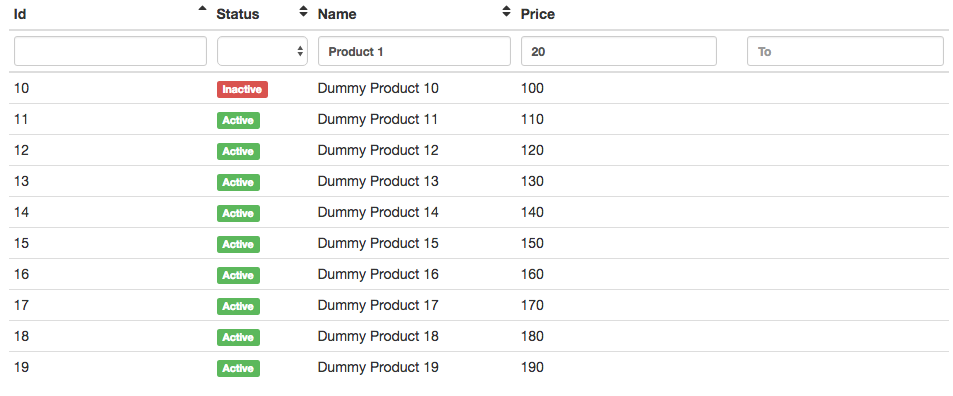

# Ng2-Search-Table

Ng2SearchTable is Angular2 Components to display remote data in a table,
and You can customize table header and rows easily.

# Installing

```
npm install ng2-search-table --save
```

#  Usage

You can easily create data table like  the following.



Adding ng2-search-table to NgModule like this,

```
// ...
import {Ng2SearchTableModule} from "ng2-search-table/ng2-search-table";

@NgModule({
  imports: [
    // something ...
    Ng2SearchTableModule.forRoot() // add it
  ],
  // ...
})
// ...
```

import ng-2search-table header/filter/table components,

```
// Header
import {SearchTableComponent} from "ng2-search-table/ng2-search-table";
import {SimpleHeaderComponent} from "ng2-search-table/ng2-search-table";
import {SortableHeaderComponent} from "ng2-search-table/ng2-search-table";

// Filter
import {TextFilterComponent} from "ng2-search-table/ng2-search-table";
import {SelectFilterComponent} from "ng2-search-table/ng2-search-table";
import {FromToTextFilterComponent} from "ng2-search-table/ng2-search-table"
```

and create table components

```
// template.html
// ...

<search-table #searchTable [tableClass]="'table table-condensed'"
              [columns]="headerComponents" [config]="searchTableConfig">
  <tr *ngFor="let row of searchTable.dataRows">
    <td [hidden]="!showId">{{row.id}}</td>
    <td [hidden]="!showStatus">
      <label class="label label-danger" *ngIf="row.status == 'inactive'">Inactive</label>
      <label class="label label-success" *ngIf="row.status == 'active'">Active</label>
    </td>
    <td [hidden]="!showName">{{row.name}}</td>
    <td [hidden]="!showPrice">{{row.price}}</td>
  </tr>
</search-table>

// ...
```

```
// app.component.ts

// ...
searchTableConfig: any = {
  url: "http://localhost:3000/inventories",
  defaultPagePer: 20
};
headerComponents: any = [
  {
    name: "id",
    model: {displayName: "Id"},
    headerComponent: SortableHeaderComponent,
    filterComponent: TextFilterComponent
  },
  {
    name: "status",
    model: {
      displayName: "Status",
      selectValues: [
        { },
        { id: "inactive", name: "Inactive" },
        { id: "active", name: "Active" }
      ]
    },
    headerComponent: SortableHeaderComponent,
    filterComponent: SelectFilterComponent
  },
  {
    name: "name",
    model: {displayName: "Name"},
    headerComponent: SortableHeaderComponent,
    filterComponent: TextFilterComponent
  },
  {
    name: "price",
    model: {
      displayName: "Price",
      multipleFilter: [
        {
          name: "priceFrom",
          placeholder: "From"
        },
        {
          name: "priceTo",
          placeholder: "To"
        }
      ]
    },
    headerComponent: SimpleHeaderComponent,
    filterComponent: FromToTextFilterComponent
  },
];

showId: boolean = true;
showStatus: boolean = true;
showName: boolean = true;
showPrice: boolean = true;

```

and remote server need to response

```
{
  "page": 1,
  "per": 20,
  "totalCount": 500,
  "results": [
    {
      "id": 1,
      "status": "active",
      "name": "Dummy Product 1",
      "price": 10,
      "created_at": "2016-08-16T12:05:34.000Z",
      "updated_at": "2016-08-16T12:05:34.000Z"
    },
    {
      "id": 2,
      "status": "active",
      "name": "Dummy Product 2",
      "price": 20,
      "created_at": "2016-08-16T12:05:34.000Z",
      "updated_at": "2016-08-16T12:05:34.000Z"
    },
    ...
  ]
}  
```

Thats all.

# More examples

Visit out examples repository https://github.com/nishio-dens/ng2-search-table-example

# Demo

works in progress

# License

Code licensed under MIT License.
